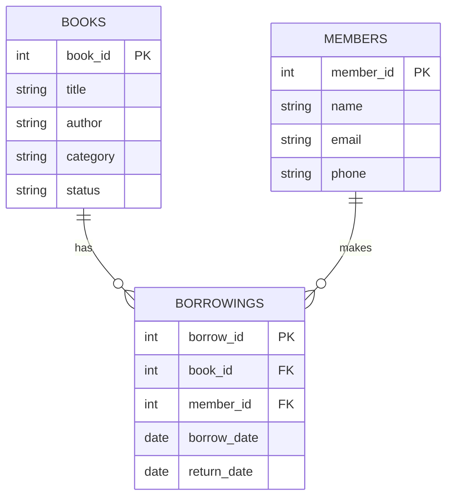

# CSCI211 Project 1 - Library Management System

A simple CRUD (Create, Read, Update, Delete) application built with Rust, Actix-web, and SQLx for managing a basic library system.

## Overview

This project implements a basic library management system that allows librarians to manage books, members, and borrowing records. The application is built using Rust's Actix-web framework for the web server and SQLx for database operations.

## Features

- Manage Books:
  - Add new books
  - Update book information
  - Delete books
  - View book details
  - Track book status (available/borrowed)

- Manage Members:
  - Register new members
  - Update member information
  - Remove members
  - View member details

- Handle Borrowings:
  - Record book borrowings
  - Process book returns
  - Track borrowing history
  - View current borrowings

## Database Schema

The application uses a PostgreSQL database with the following structure:

### Books Table
- `book_id` (Primary Key)
- `title`
- `author`
- `category`
- `status`

### Members Table
- `member_id` (Primary Key)
- `name`
- `email`
- `phone`

### Borrowings Table
- `borrow_id` (Primary Key)
- `book_id` (Foreign Key)
- `member_id` (Foreign Key)
- `borrow_date`
- `return_date`

## Technologies Used

- Rust
- Actix-web (Web Framework)
- SQLx (Database Library)
- MariaDB (Database)
- Serde (Serialization)

## API Endpoints

### Books
- `GET /books` - List all books
- `GET /books/{id}` - Get book details
- `POST /books` - Add a new book
- `PUT /books/{id}` - Update book information
- `DELETE /books/{id}` - Delete a book

### Members
- `GET /members` - List all members
- `GET /members/{id}` - Get member details
- `POST /members` - Register a new member
- `PUT /members/{id}` - Update member information
- `DELETE /members/{id}` - Remove a member

### Borrowings
- `GET /borrowings` - List all borrowings
- `GET /borrowings/{id}` - Get borrowing details
- `POST /borrowings` - Create a new borrowing record
- `PUT /borrowings/{id}` - Update borrowing information
- `DELETE /borrowings/{id}` - Delete a borrowing record

## ER Diagram

